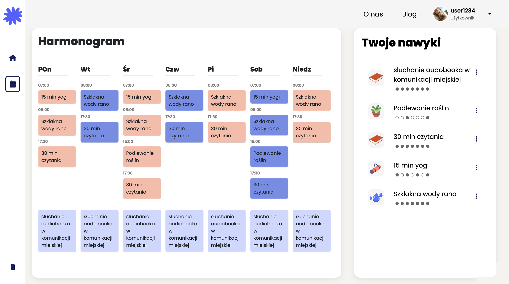

# Habito - Your Personal Habit Tracker

Welcome to **Habito**, your go-to tool for building and maintaining healthy habits. With Habito, you can easily create an account, schedule your habits, track your progress, and gain valuable insights into your habit-building journey.

## Features

- **User Accounts**: Create a personal account to keep your habits and progress synced across devices.

- **Habit Scheduling**: Schedule your daily, weekly, or monthly habits with ease.

- **Habit Registration**: Mark habits as completed when you've accomplished them for the day.

- **Statistics and Insights**: Gain insights into your habit streaks, trends, and overall progress with intuitive statistics.

- **Secure and Private**: Your habit data is kept secure and private, accessible only to you.

## Getting Started

1. **Installation**: To get started with Habito, simply visit our website https://limba.wzks.uj.edu.pl/~20_zygilewicz/habito_app/ and create your account.

2. **Adding Habits**: After logging in, click on "Add Habit" to create a new habit. Set the frequency and any additional details you need.

3. **Daily Tracking**: Each day, click on your habit and mark it as completed when you've achieved it.

4. **Accessing Statistics**: Track your progress and view insightful statistics by entering habits' details.

